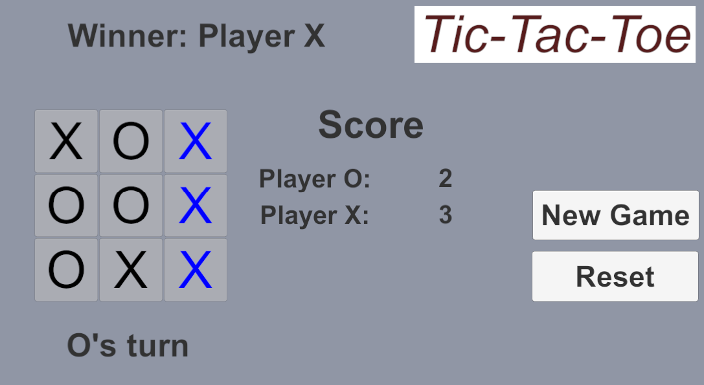

# Tic-Tac-Toe

## Welcome to the TicTacToe game developed using C# and Unity! This README provides a comprehensive overview of the game, its features, how to set it up, and how to play.

&nbsp;

# Introduction
This TicTacToe game is a simple yet classic implementation of the well-known game using C# programming language and the Unity game development engine. The objective of the game is to form a line of three of your symbols (either "X" or "O") on a 3x3 grid.

# Features
* Player vs. Player: Play against a friend on the same device, taking turns to make your moves.
* Winning Logic: The game automatically detects when a player wins or if the game ends in a draw.
* UI Feedback: Clear UI messages provide feedback on game status, such as whose turn it is or when the game is over.
* Restart: After a game concludes, players can easily restart and play again.

# Installation
1. Prerequisites: Make sure you have Unity installed. If not, you can download it from the [Unity website](https://unity.com/download).

2. Clone the Repository: Clone this repository to your local machine using your preferred method (Git command line or GUI).

3. Open the Project: Open the cloned repository in Unity by selecting the project folder.

4. Build Settings:

* Open the Build Settings in Unity (File > Build Settings).
* Select your target platform (e.g., Android, iOS, PC).
* Click "Build" to generate the game executable for your chosen platform.
* Run the Game: Run the game executable on your target platform and enjoy playing TicTacToe!

# How to Play
* Start the Game: Launch the game, and you'll be greeted with the TicTacToe grid.

* Take Turns: Two players can play on the same device. One player is assigned "X," and the other "O." Take turns tapping on empty cells to place your symbol.

* Winning: The game automatically detects if a player has won by forming a line of three symbols horizontally, vertically, or diagonally.

* Draw: If all cells are filled and no player has formed a winning line, the game ends in a draw.

* Restart: After a game concludes, you can reset the grid and keep the score by clicking the "Reset" button. If you want to reset the score, click on the "New Game" button.

# Contributing
Contributions are welcome! If you have any suggestions, bug fixes, or enhancements, feel free to submit a pull request.

# License
This project is licensed under the MIT License, allowing you to use, modify, and distribute the code freely.

&nbsp;

Thank you for checking out my TicTacToe game! Have fun playing and experimenting with the code. If you have any questions or issues, please feel free to contact me.

&nbsp;

Project Maintainers: Ethan Lin  
Contact: ethanlin313@gmail.com